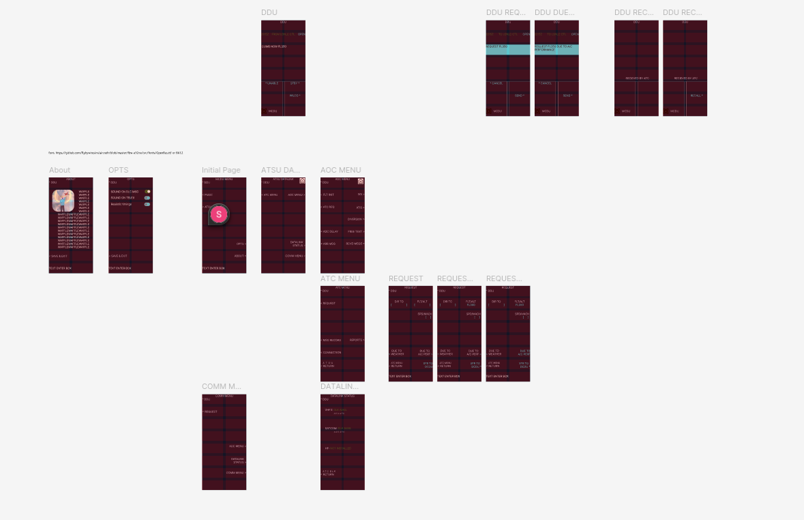

# Design Files

This directory contains the design files for the project. The design files are created using [figma](https://www.figma.com/). The overall layout can be seen by the [Prototype](https://www.figma.com/proto/bThUF7HTLqGAd5BoWwKBxg/PAPL-Coursework?node-id=0-1&t=X16i0KMXD66UfTlg-1) or by viewing the project in [Figma](https://www.figma.com/design/bThUF7HTLqGAd5BoWwKBxg/PAPL-Coursework?node-id=0-1&m=dev&t=X16i0KMXD66UfTlg-1).

(In case you can't access it, a basic screenshot of the layout is listed below)

